# Architecture Documentation

This document provides a comprehensive overview of the b.sure Chatbot Grafana Panel architecture using visual diagrams.

## System Overview

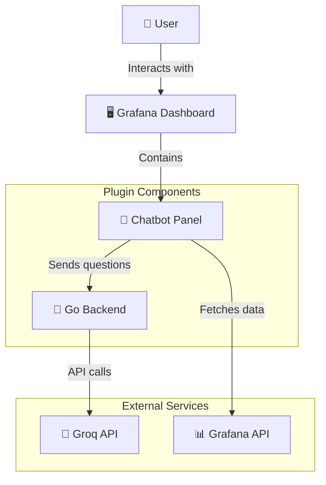

## Plugin Architecture

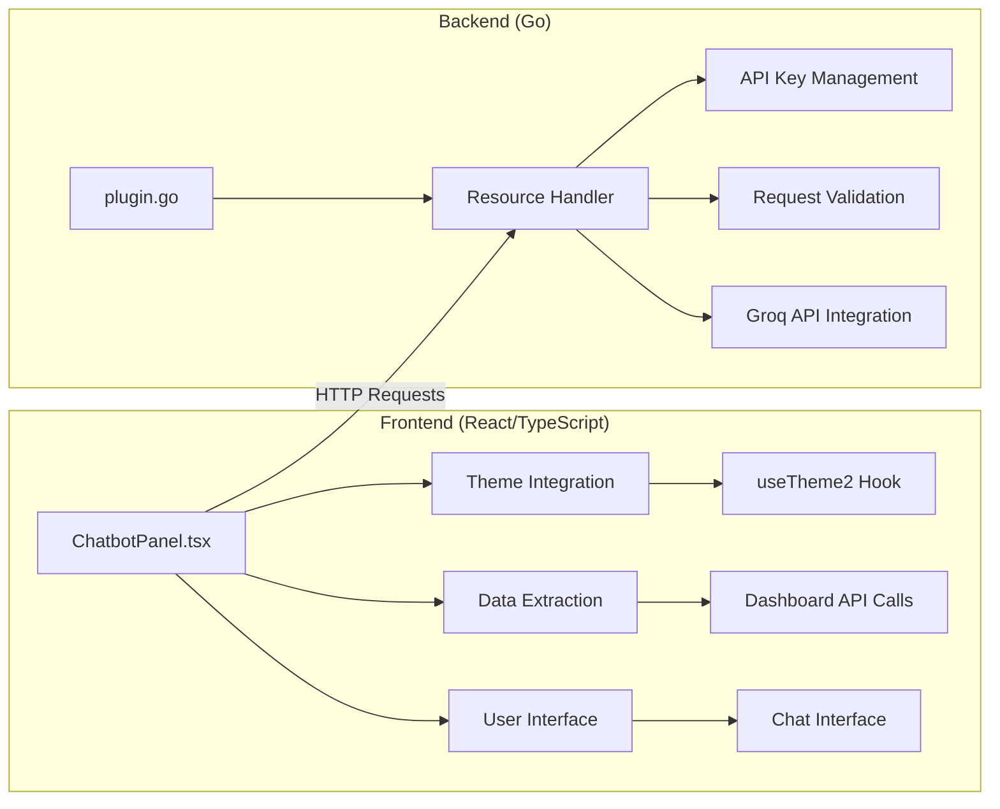

## Data Flow Architecture

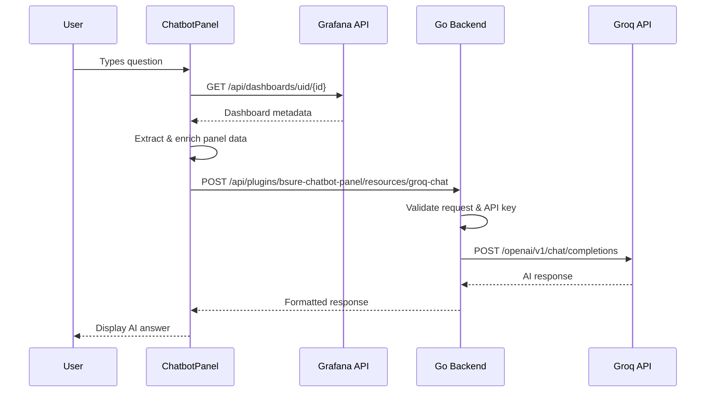

## Component Structure

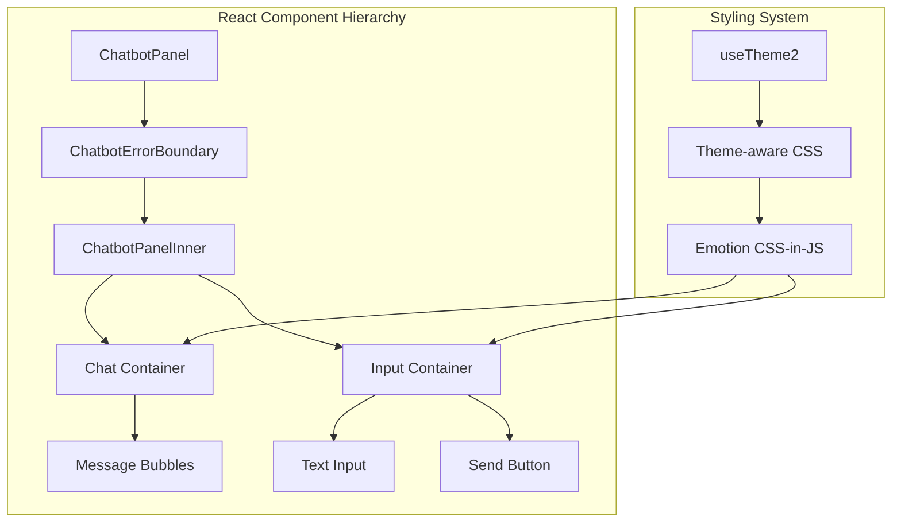

## Security Architecture

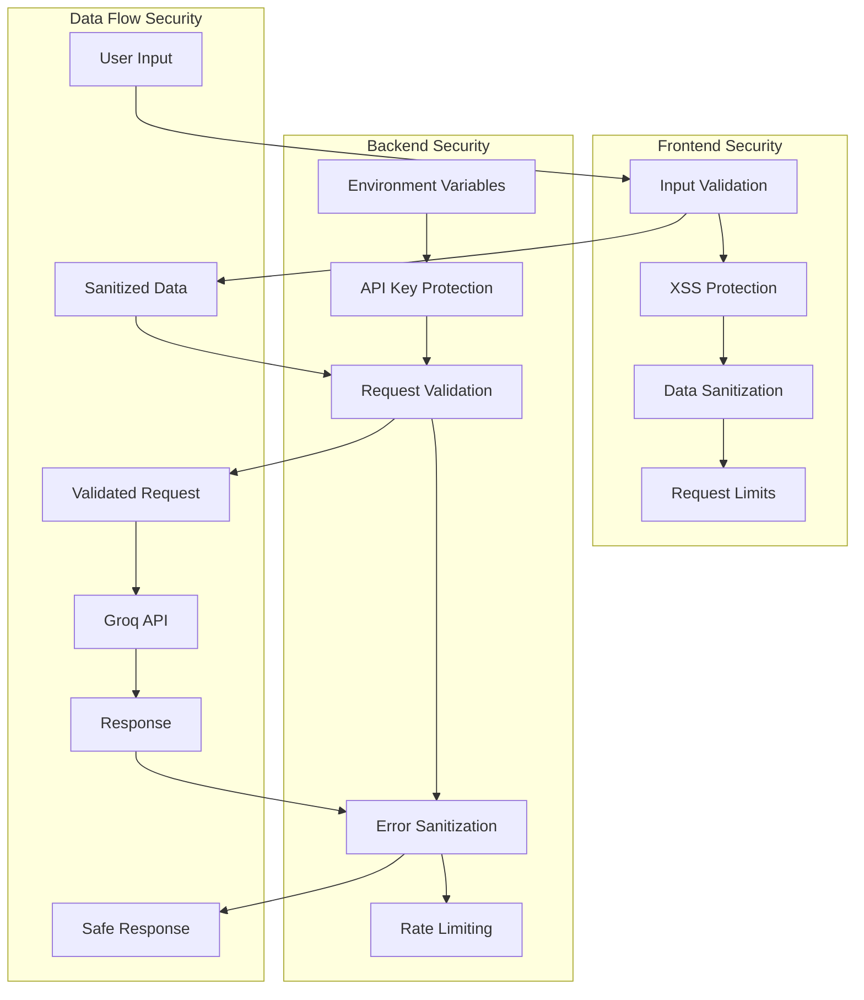

## Configuration Management

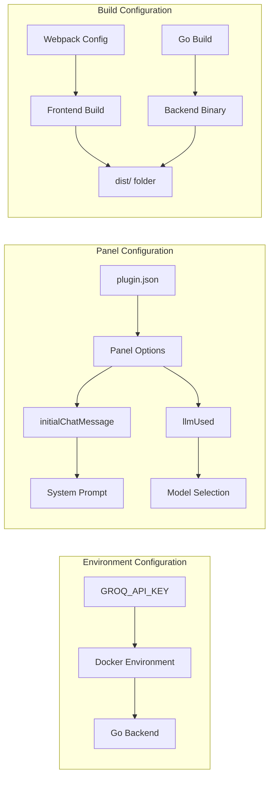

## Development Workflow

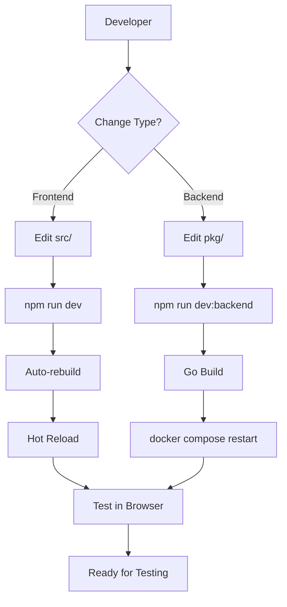

## API Integration Flow

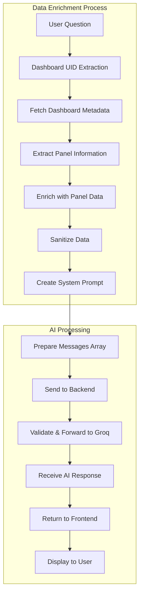

## Error Handling Architecture

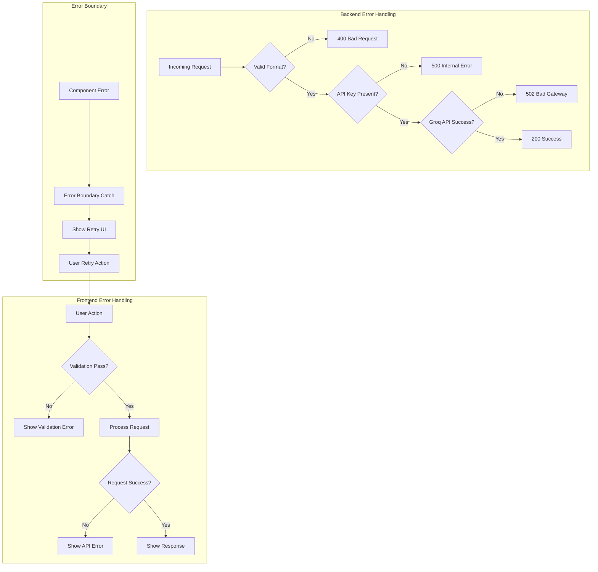

## Build & Deployment Pipeline

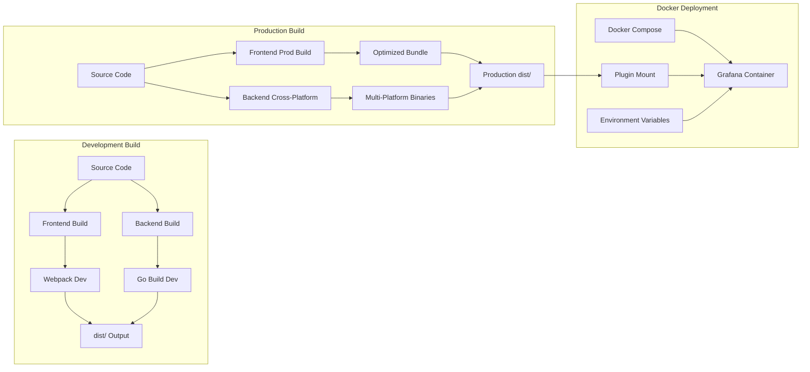

## Technology Stack

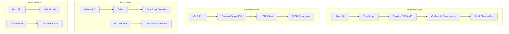

## Key Features & Capabilities

- **🔒 Enterprise Security**: API keys never exposed to frontend
- **🎨 Theme Integration**: Full support for Grafana dark/light themes
- **📊 Data Enrichment**: Automatically includes dashboard context
- **⚡ Real-time Chat**: Interactive conversation interface
- **🛡️ Input Validation**: Comprehensive XSS and injection protection
- **🔄 Error Recovery**: Graceful error handling with retry mechanisms
- **📱 Responsive Design**: Works across different screen sizes
- **♿ Accessibility**: ARIA labels and keyboard navigation support
